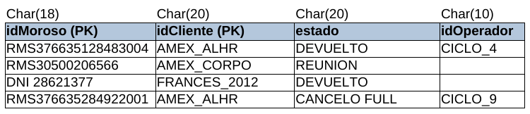
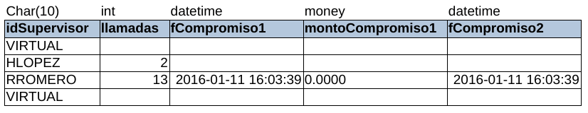
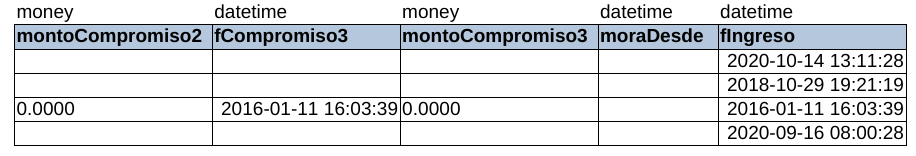
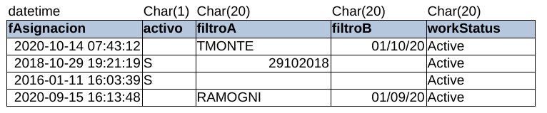

# Tabla CARTERA

* **idMoroso:** sirve para identificar a la persona que tiene una deuda con algún cliente.
* **IdCliente:** identifica a cada cliente.
* **Estado:** Muestra el estado de cada moroso respecto a MOPC, devuelto significa que no se pudo solucionar y volvió al banco.
* **IdOperador:** código con el cual se identifica al operador o equipo de operadores que gestionó al moroso.
* **IdSupervisor:** La identificación del supervisor de MOPC a cargo del moroso.
* **Llamadas:** número de llamadas hechas al moroso.
* **FCompromiso1:** la fecha en la que el moroso se comprometió a pagar por primera vez
* **montoCompromiso1:** el monto por el cual se comprometió el moroso en la fCompromiso1
* **FCompromiso2:** la fecha en la que el moroso se comprometió a pagar por segunda vez
* **montoCompromiso2:** el monto por el cual se comprometió el moroso en la fCompromiso2
* **FCompromiso3:** la fecha en la que el moroso se comprometió a pagar por tercera vez
* **montoCompromiso3:** el monto por el cual se comprometió el moroso en la fCompromiso3
* **moraDesde:** está al pedo (8 bytes c/u)
* **fechaIngreso:** es la fecha en la cual ingresó el moroso
* **fechaAsignación:** es la cual fue asignado a un operador en específico
* **activo:** es el estado de gestión, describe cómo está MOPC con esa persona.
* **FiltroA y B:** son segmentos del cliente (una subdivisión que pone el cliente).
* **WorkStatus:** Muestra si está trabajando con esa persona o se le dejó en un estado standby.
