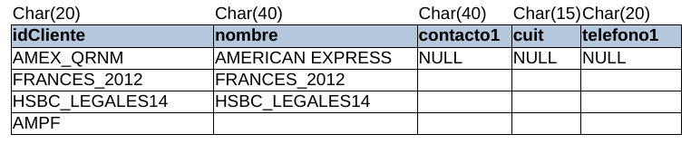
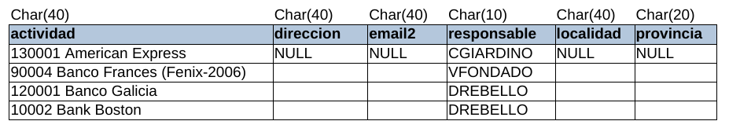
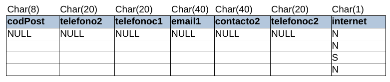
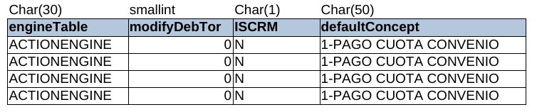
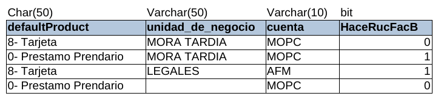

# Tabla CLIENTE

* **idCliente:** El ID único del cliente de MOPC, **CLIENTE** son los diferentes bancos, supermercados y empresas que tienen convenio con MOPC.
* **nombre:** El nombre del cliente de MOPC.
* **contacto1:**
* **cuit:**
* **telefono1:**
* **actividad:**
* **direccion:**
* **email2:**
* **responsable:**
* **localidad:**
* **codPost:**
* **telefono2:**
* **telefonoc1:**
* **email1:**
* **contacto2:**
* **telefonoc2:**
* **internet:**
* **engineTable:**
* **modifyDebTor:**
* **ISCRM:**
* **defaultConcept:**
* **defaultProduct:**
* **unidad_de_negocio:**
* **cuenta:**
* **HaceRucFacB:**