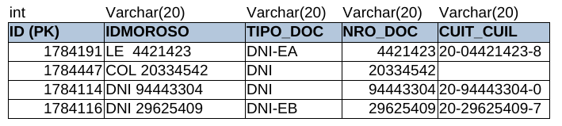
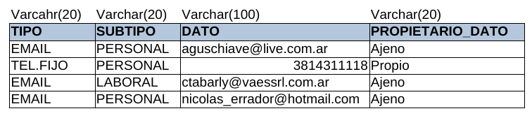
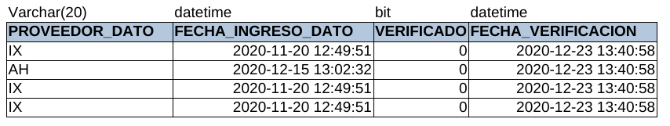
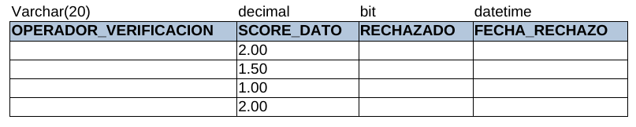
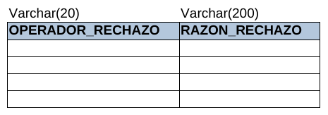

# Tabla DAM_CONTACTABILIDAD

Esta tabla posee todos los datos de contacto de los morosos que tenemos en la base de datos.

* **ID:** es el id único de la tabla que es autoincremental.
* **IDMOROSO:** Posee los datos DNI u otro registro de cada moroso en la lista.
* **TIPO_DOC:** Es el tipo de documento según los clientes.
* **NRO_DOC:** Es el número de documento que nos pasa el cliente.
* **CUIT_CUIL:** Es el registro único para cada persona (en Paraguay parecido al RUC).
* **TIPO:** Es el tipo de dato de contacto que se tiene de la persona.
* **SUBTIPO:** Se refiere a si es personal o laboral.
* **DATO:** es el dato de contacto de la persona, pueden ser números de teléfono o emails.
* **PROPIETARIO_DATO: ** a quién pertenece el dato de contacto. 
* **PROVEEDOR_DATO:** es la empresa la cual nos proveyó el dato o enriqueció nuestra base de datos.
* **FECHA_INGRESO_DATO:** es cuando ingresó a la base de datos.
* **VERIFICADO:** Si está verificado que realmente pertenece a la persona.
* **FECHA_VERIFICACION:** la fecha en la cual se realizó la verificación.
* **OPERADOR_VERIFICACION:** el nombre del operador que hizo la verificación correspondiente del dato.
* **SCORE_DATO:** puntaje asociado a la validez del dato.
* **RECHAZADO:** se verificó que no corresponde a la persona.
* **FECHA_RECHAZO:** la fecha en la cual fue rechazado.
* **OPERADOR_RECHAZO:** operador el cual efectuó el rechazo.
* **RAZON_RECHAZO:** la razón por la cual se llevó a cabo el rechazo.