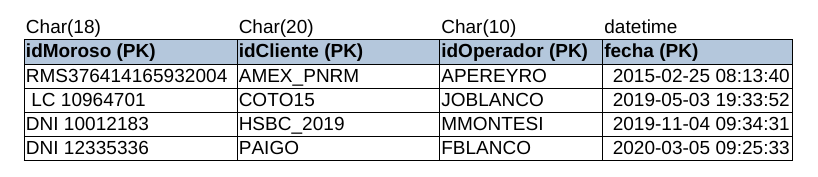
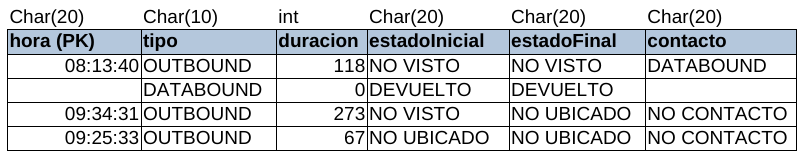
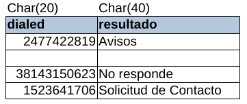
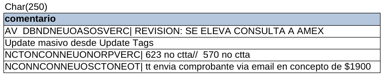

# Tabla LLAMADA

* **idMoroso:** se trata del identificador de cada persona y es único.
* **idCliente:** es el cliente de MOPC con el cual se mantiene la deuda.
* **idOperador:** es el operador encargado de la llamada realizada.
* **fecha:** es la fecha y hora en la cual se efectuó la llamada.
* **hora:** es la hora en tipo char en la que se realizó la llamada.
* **tipo:** 
* **duracion:** es la duración de la llamada
* **estadoInicial:** 
* **estadoFinal:**
* **contacto:** 
* **dialed:**
* **resultado:** Es a lo que llegó finalmente el operador.
* **comentario:** Es una información adicional sobre el caso que agrega el operador.