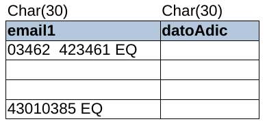

# Tabla MOROSO

* **idMoroso:** sirve para identificar a la persona que tiene una deuda con algún cliente.
* **nombre:** Contiene los nombres y apellidos de los morosos
* **direccion:** Dirección del moroso.
* **direccionS:** 
* **localidad:** Localidad del moroso
* **provincia:** provincia del moroso
* **codPost:** Código postal de la persona.
* **telParts:** es "S" si tiene teléfonos particulares.
* **direccionAlt:** dirección alternativa.
* **direccionAltS:** es "S" si tiene dirección alternativa.
* **telCom:**
* **telPart:** teléfono particular de la persona.
* **telComS:**
* **localidadAlt:** localidad alternativa
* **telCel:** Teléfono celular.
* **provinciaAlt:** Provincia alternativa.
* **telCelS:** 
* **telAlt1:** teléfono alternativo 1.
* **telAlt1S:** si tiene teléfono alternativo.
* **telAlt2:** teléfono alternativo 2
* **telAlt2S:** si tiene un segundo teléfono alternativo.
* **telAlt2:** teléfono alternativo 3
* **telAlt2S:** si tiene un tercer teléfono alternativo.
* **email1:**
* **datoAdic:** Algún dato adicional.