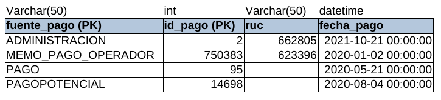
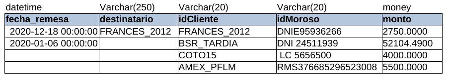
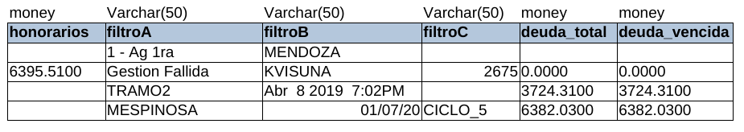
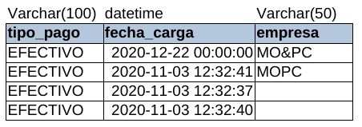

# Tabla PAGOS_UNIFICADOS

* **fuente_pago:** El lugar desde el cual el moroso realizó un pago. **MEMO_PAGO_OPERADOR** representa a un pago hecho directamente a MOPC y esos pagos se remesan para confirmarlos.
* **id_pago:** identificador del pago realizado por la persona.
* **ruc:** ruc de la persona que realizó el pago.
* **fecha_pago:** la fecha en la cual realizó el pago (se podría reemplazar por date).
* **fecha_remesa:** la fecha en la cual se realizó la confirmación del pago por parte de MOPC (se podría reemplazar por date).
* **destinatario:** destinatario al cual va el pago.
* **idCliente:** el cliente de MOPC al cual pertenece la persona.
* **idMoroso:** identificación única del moroso.
* **monto:** el monto del pago realizado.
* **honorarios:** honorarios por el pago realizado.
* **filtroA, filtroB y filtroC:** son segmentos del cliente (una subdivisión que pone el cliente).
* **deuda_total:** la deuda total actual del moroso.
* **deuda_vencida:** monto de la deuda que está vencida.
* **tipo_pago:** define si se realizó un pago en efectivo o una refinanciación.
* **fecha_carga:**
* **empresa:**